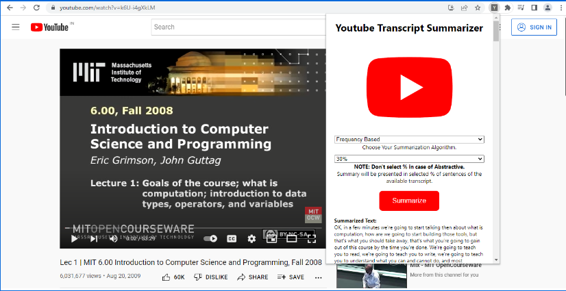

# Youtube-Transcript-Summarizer

In this project, we have created a Chrome Extension which will make a request to a backend REST API where it will perform NLP and respond with a summarized version of a YouTube transcript and also in different languages.



- Install python3
- install virtual environment for your 3.X.* version 


```sh
    sudo apt install python3-venv
```

- Create a local environment : 
    ```sh
      python3 -m venv env
    ```

- Activate your environment 
    ```sh
      source env/bin/activate
    ```
  
- Install application dependencies : 
    ```sh
      pip install -r requirements.txt
    ```

- Run the application
    ```sh
      python3 manage.py runserver
    ```
  